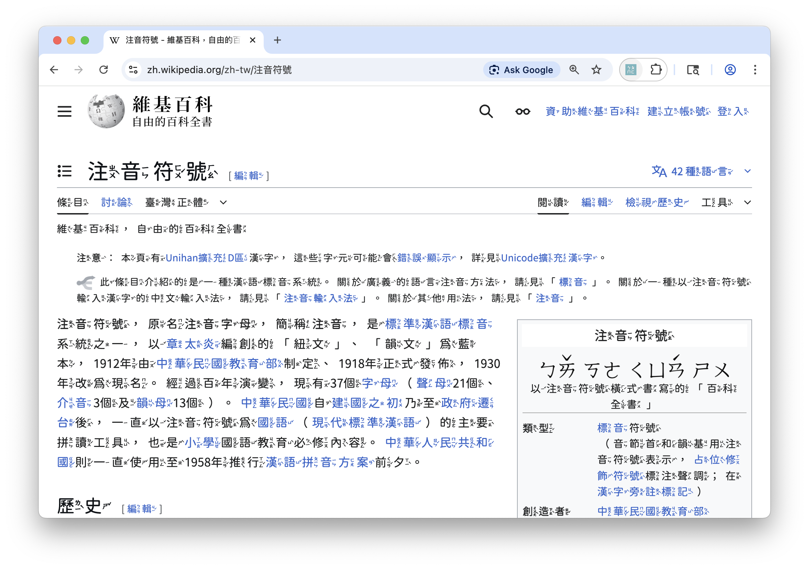

# zhuyin 🔖

Chrome extension to display Zhuyin Fuhao (bopomofo) next to Traditional Chinese characters.



## Install

Install from the [Chrome Web Store].


## Development

Clone this repository and create the build files.

```sh
make build
```

Go to the Extensions page on the Chrome browser: Ellipses icon (`⋮`) > Extensions > Manage Extensions, or visit [chrome://extensions/](chrome://extensions/).

Toggle on the "Developer Mode" checkbox.

Click on the now-visible "Load unpacked" button and open the build directory.

*Zhuyin* should now be available for use in the extensions list.


## Release

Create the release package.

```
make dist
```

<!-- Links -->
[Chrome Web Store]: https://chromewebstore.google.com/detail/fhdhamhibalnnkhegplacedkfpidibgk?utm_source=item-share-cb
